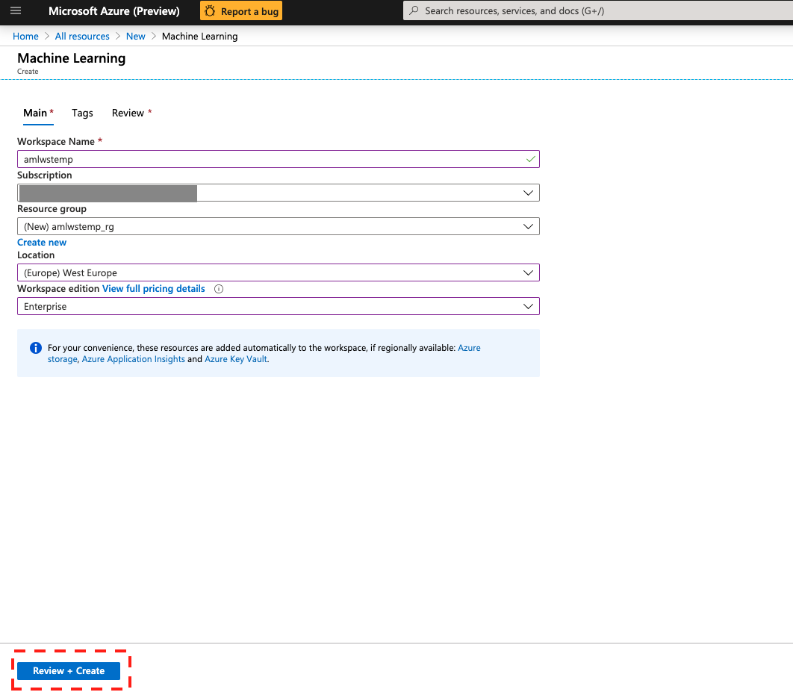
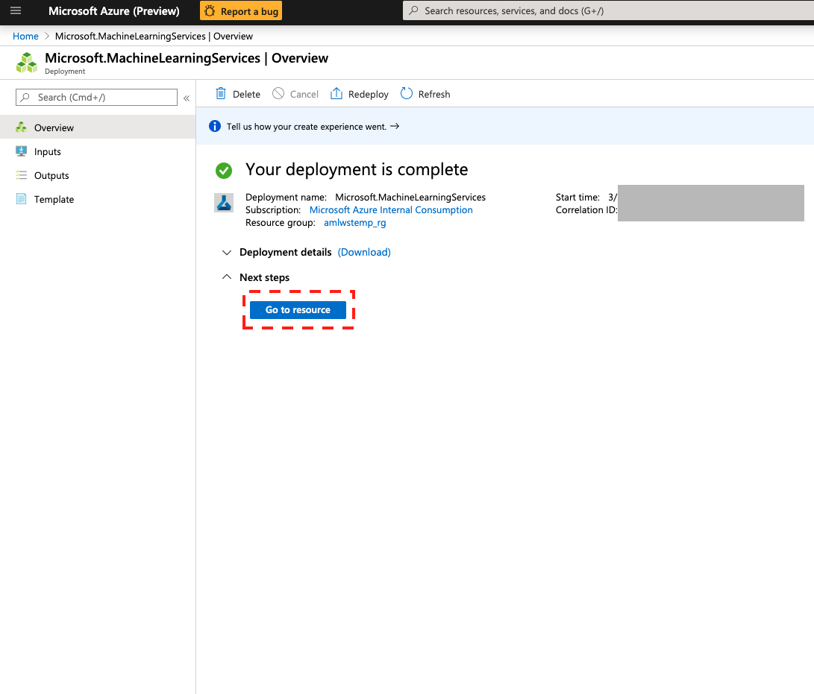
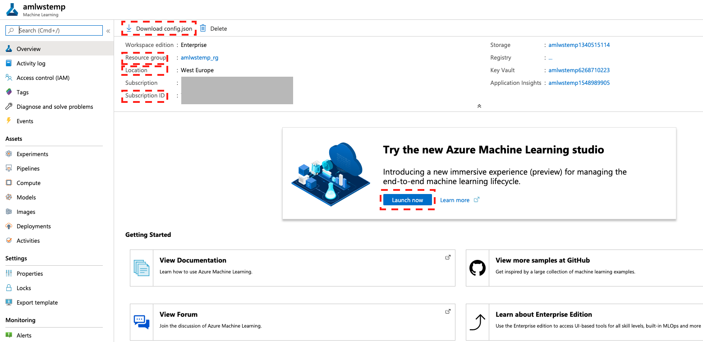
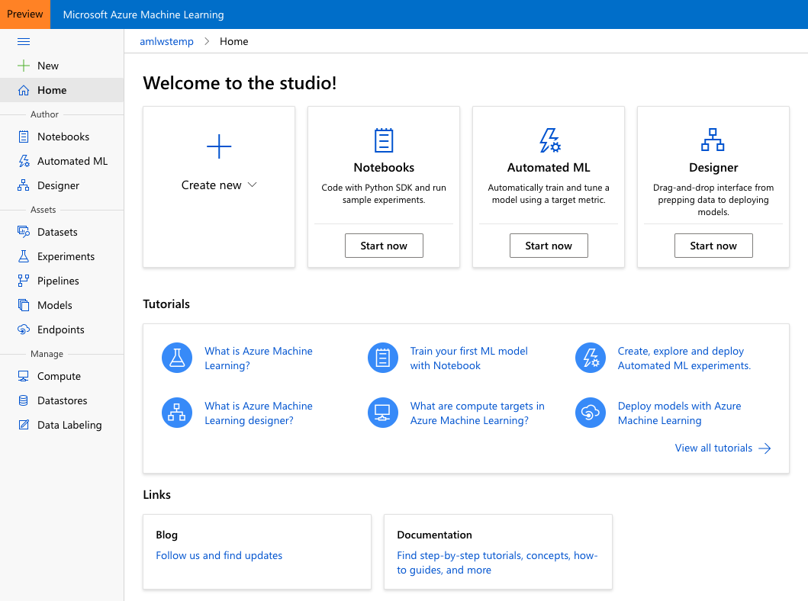
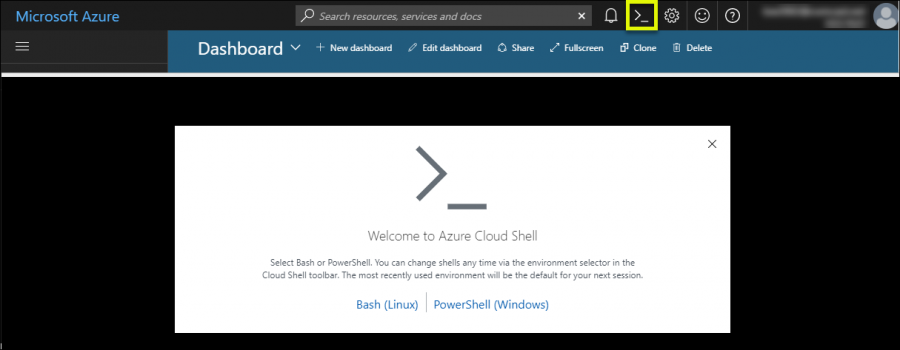
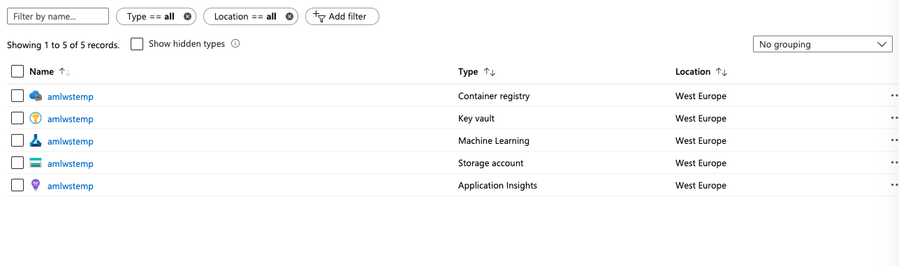

# Setting up AzureML workspace 

## Prerequisites
This module provides a walkthrough for setting up a new AML workspace. To run through the next sections, you will need an Azure subscription. See also instructions on how to create a workspace [here](https://docs.microsoft.com/en-us/azure/machine-learning/how-to-manage-workspace).

### Objectives

In this hands-on lab, you will learn how to:

- Setup AzureML workspace using UI
- Setup AzureML workspace using SDK
- Setup AzureML workspace using CLI

## Create an AzureML workspace via Azure Portal UI

1. In you Azure portal navigate to 'Create a resource' and click

   

2. In 'Azure Marketplace' tab navigate to 'AI + Machine Learning' tab select 'Machine Learning' and click

   

3. Type a name for the workspace (default *amlwstemp*) and select (or create a new - default *amlwstemp_rg*) resource group, location and edition of the workspace (see details [here](https://docs.microsoft.com/en-us/azure/machine-learning/overview-what-is-azure-ml#sku)). Click on 'Review + Create' and then 'Create'

   

   This process will create the following resources:

   

4. Wait for deployment and then click on 'Go to resource'  

   

5. In the resource blade, you have access to all the meta data needed to refer to your workspace e.g. name, resource group, etc. (you can download all these info as a json file, "config.json"). To access Azure Machine Learning Studio click on "Launch now"

   

   This will take you to your Azure ML studio

   

Learn more about how to [create and manage Azure Machine Learning workspaces in the Azure portal](https://docs.microsoft.com/en-us/azure/machine-learning/how-to-manage-workspace).

## Setup AML workspace using CLI 

Here we use a bash script for setting up an Azure ML workspace.

You can execute the below commands in any bash console. For simplicity you can use the embedded Azure Cloud Shell from your Azure portal

  

Execute the following commands:
  
  **Note:** You can change PREFIX and LOCATION in create-env.sh (optional). Current script creates resources with prefix **amlwstemp** in **westeurope** region.
  
  **Note:** If multiple users under same subscription and resource group are creating multiple workspaces during the workshop, edit 'create-env.sh' and add the *$RANDOM* element to the *PREFIX*. This will create resources with unique names for each user and avoids conflict name error.
  
   - Clone Git repository
     ```sh
     $ git clone https://github.com/Sahiep/aml-hands-on-lab
     ``` 
   - Access *0-Setup/CLI/* folder
     ```sh
     $ cd aml-hands-on-lab/0_setup/resources/
     ``` 
   - Execute the bash script
     ```sh
     $ . create-env.sh
     ``` 


As a result, following ressources will be deployed in your defined resource group
* Azure Key Vault
* Azure Machine Learning Workspace
* Azure Storage Account
* Azure Application Insights
* Azure Container Registry


  

Learn more about how to [create a workspace for Azure Machine Learning with Azure CLI](https://docs.microsoft.com/en-us/azure/machine-learning/how-to-manage-workspace-cli).

## Setup AzureML workspace using Python SDK 

Python script for AzureML Workspace setup

### Requirements

[dotenv](https://pypi.org/project/python-dotenv/)  
[azureml](https://docs.microsoft.com/en-us/python/api/overview/azure/ml/install?view=azure-ml-py)  
[azure](https://azure.github.io/azure-sdk/releases/latest/all/python.html) [azure.common, azure.mgmt.resource, azure.mgmt.storage]

### Setup

Execute the following command:

Note: You can change resource names and location in .env file.

 - Clone Git repository
   ```sh
   $ git clone https://github.com/Sahiep/aml-hands-on-lab
   ``` 
 - Access SDK folder
   ```sh
   $ cd aml-hands-on-lab/0_setup/resources/
   ``` 
 - Execute the Python script
   ```sh
   $ . python create-env.py
   ```

As a result, following ressources will be deployed in your defined resource group

* Azure Key Vault
* Azure Machine Learning Workspace
* Azure Storage Account
* Azure Application Insights

  
