# Introducing Key Concepts of AzureML 

### Objectives

In the following exercise you will learn about the kex concepts of the AzureML Service: 
- Compute Targtes
    - Compute Cluster
    - Compute Instances
- Datastores and Datasets

## Setting up the Compute Targets

### Prerequisites

To run through below instructions, you need an Azure subscription and an Azure ML workspace. See instructions on how to create a workspace [here](../../../0_setup/setup.md) and more details [here](https://docs.microsoft.com/en-us/azure/machine-learning/concept-compute-target).

### Creating an AzureML compute cluster

We will do a number of actions that require a compute target to be exectuted on. We will start by creating a cluster of CPU VMs.

1. Navigate to 'Compute' > 'Training Clusters' in the "Manage" section and click 'New'.

1. Call the cluster 'cpu-cluster'.
    - For machine size choose 'Standard_D2_v2' (that is an inexpensive general purpose VM size at about $0.14/hour). See details about AzureML compute pricing [here](https://azure.microsoft.com/en-us/pricing/details/machine-learning/).
    - Set the 'minimum number of nodes' to 0 and the  the 'maximum number of nodes' to 10. That way the cluster will scale automatically to up to 10 nodes as jobs require them.
    - Set the 'Idle seconds before scale down' to 10800. That means that nodes will be kept around for 3 hours before they are spun down. That way, during our workshop, jobs won't have to wait for spin-up. Make sure that number is lower if you are using a more expensive VM size.

    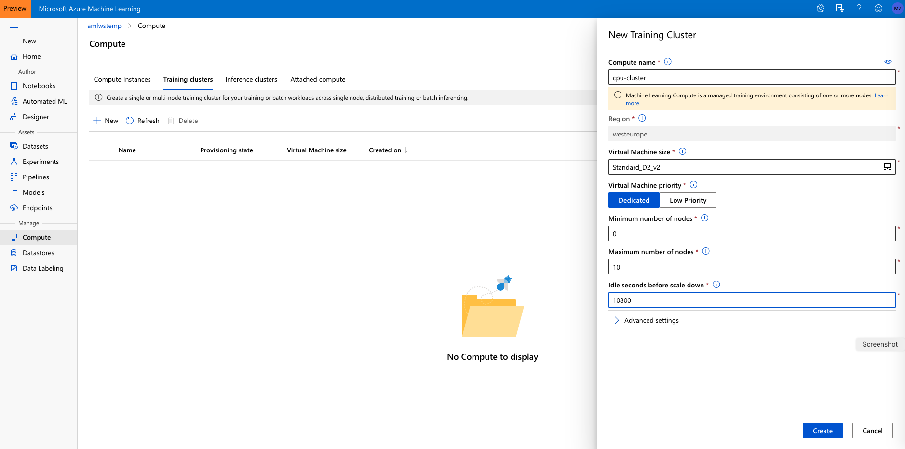

### Creating an AzureML Compute Instance

Next, we will create a compute instance. The compute instance will serve as an interactive workstation in the cloud that serves as a Jupyter server, but also hosts and instance of RStudio server and can run TensorBoard, Bokeh, Shiny or other apps used during the developement work of a data scientist.

1. Navigate to 'Compute Instance' tab in Compute and click on 'New'.

2. Choose some sufficiently unique name, keep the default VM type (STANDARD_DS3V2 -- a fairly inexpensive machine type costing about $0.27/hour) and click 'Create':

   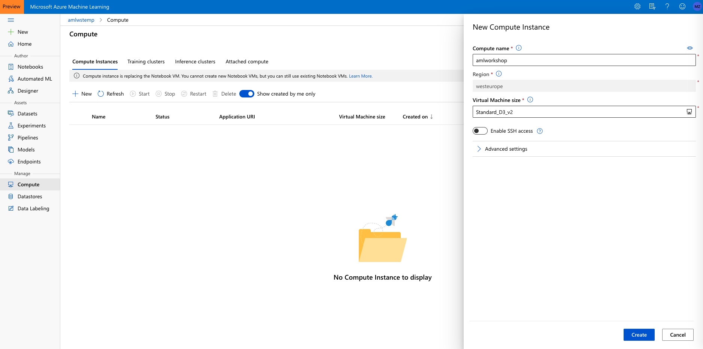

See [here](https://docs.microsoft.com/en-us/azure/machine-learning/service/how-to-configure-environment#notebookvm) for details on creating AzureML Compute instances.

**Note that this machine will keep running until you stop it from the portal. If you would like to apply an automated shutdown method (see below) follow instructions [here](https://github.com/ruoccofabrizio/azureml-compute-instances-shutdown)**

   

## Review --- Set up our development environment

### Prerequisites

To run through below instructions, you need an Azure subscription and an AzureML workspace. See instructions on how to create a workspace [here](../../0_setup/setup.md) and more details [here](https://docs.microsoft.com/en-us/azure/machine-learning/concept-compute-instance).

### Clone the Git repository ml-ws to the workspace storage

For the following parts of the workshop, you are going to work on the notebook environment hosted on the Compute instance you just created. First, you need to clone this git repository onto the workspace.

1. To get started, first navigate to the Jupyter(Lab) instance running on the Compute instance by clicking on the Jupyter(Lab) link shown:

   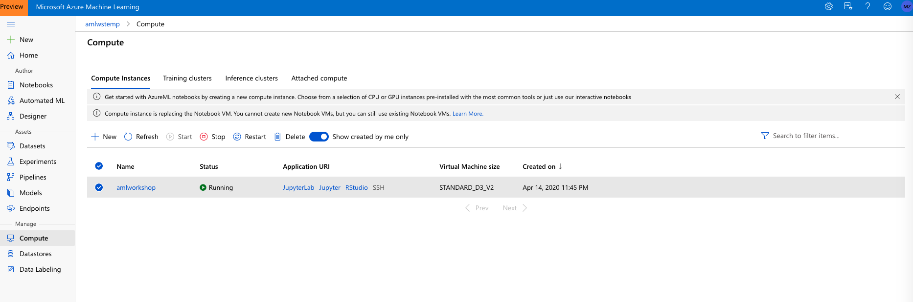

  2. After going through authentication, you will see the Jupyter(Lab) frontend. As you authenticate, make sure to use the same user to log in as was used to create the Compute instance, or else your access will be denied. Next open an Terminal (either by File/New/Terminal, or by just clicking on Terminal from the 'New' drop-down menu)

     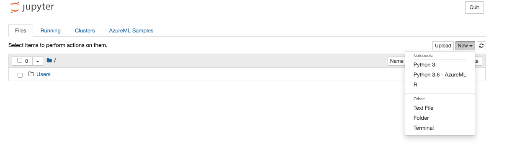

     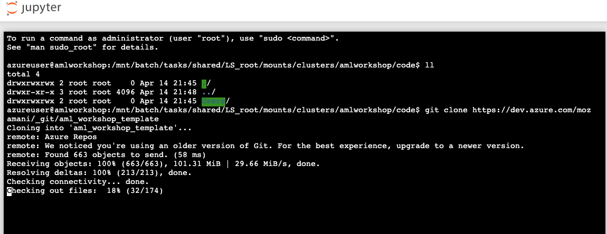

3. In the terminal window clone this repository by typing:
   ```
   $ git clone https://github.com/Sahiep/aml-hands-on-lab.git
   ```

## Review --- AzureML Datasets

### Prerequisites

To run through below instructions, you need an Azure subscription and an AzureML workspace. See instructions on how to create a workspace [here](../../../0-Setup/README.md) and more details [here](https://docs.microsoft.com/en-us/azure/machine-learning/how-to-create-register-datasets) and [here](https://docs.microsoft.com/en-us/azure/machine-learning/how-to-access-data).

### Create an AML Dataset

AzureML studio allows users to manage their dataset and datastores directly inside the portal.

A Dataset is a resource for exploring, transforming and managing data in Azure Machine Learning. 
Datasets enable:

- Easy access to data: without worrying about connection strings or data paths. Only keep a single copy of data in the storage service of your choice.

- Training with big data: seamless integration with Azure Machine Learning features like labelling, training products and pipelines. Users can share and reuse datasets in various experiments.

- Tracking data usage: Azure ML automatically tracks which version of the dataset was used for the ML experiment and produced which model.

### Option A -  Uploading a Dataset to AzureML studio

1. Download the German credit dataset by clicking on this [link](https://dev.azure.com/mozamani/aml_workshop_template/_git/aml_workshop_template?path=%2FData%2Fdatasets%2Fgerman_credit_data.csv) and saving the file to your local disk

2. Navigate to the left pane of your workspace. Select Datasets under the 'Assets' section

   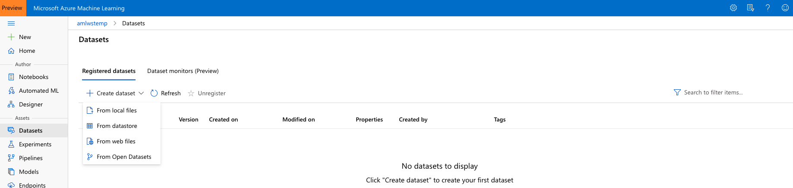

    Click on 'Create dataset' and choose 'From local files'. Name the dataset '**german-credit**' and then click 'Next'. Make sure to leave the dataset type as Tabular

    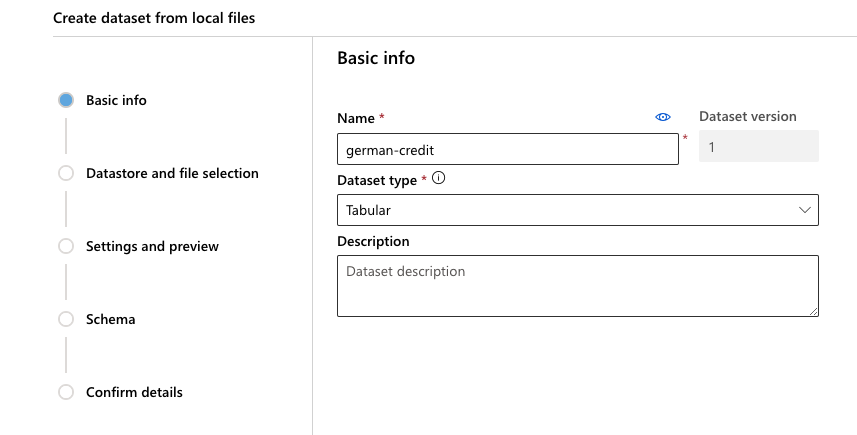

3. Click 'Browse', choose the file you had downloaded, and click 'Next' to create the dataset in the workspace's default Blob storage

   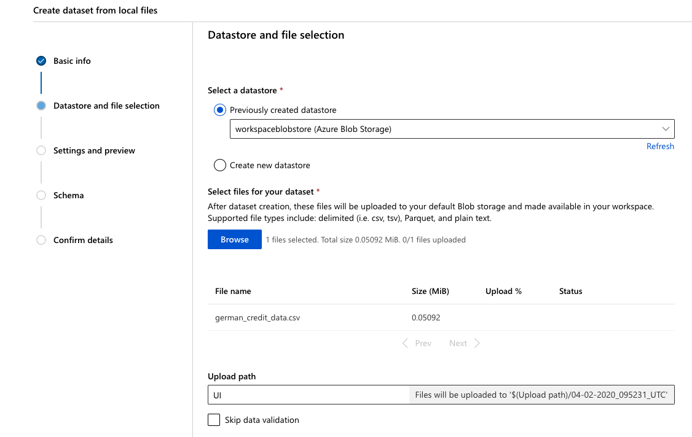

4. Click 'Next' through the following "Settings and preview" and "Schema" sections to verify that everything looks correct

   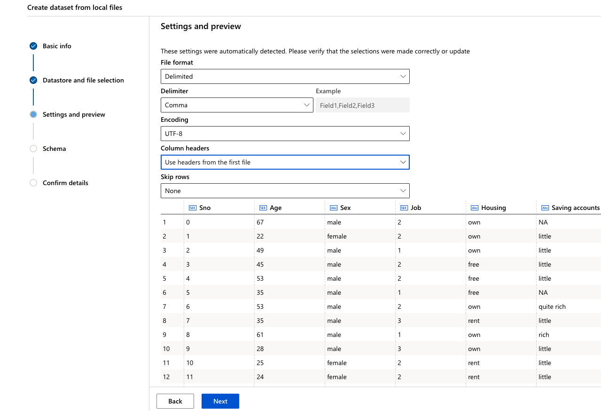

   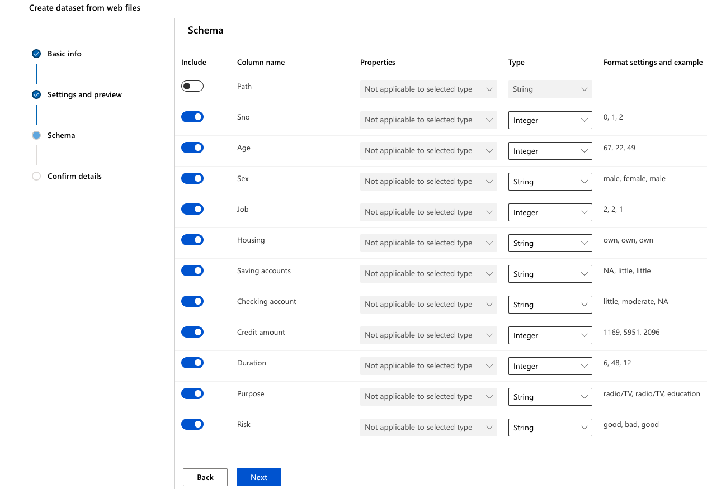

5. Finally, in the "Confirm Details" section, select "Profile this dataset after creation" and specify the 'cpu-cluster' that you previously created as the compute to use for profiling and click 'Create'

### Option B - Create a Dataset from web file

1. Here we are using German credit dataset and create a reference to the webfile:
   https://dev.azure.com/mozamani/aml_workshop_template/_git/aml_workshop_template?path=%2FData%2Fdatasets%2Fgerman_credit_data.csv

2. Navigate to the left pane of your workspace. Select Datasets under the Assets section

   

   Click on 'Create dataset' and choose 'From web files'. Copy/Paste the above URL in the Web URL box, name the dataset '**german_credit**' and then click 'Next'. Make sure to leave the dataset type as Tabular.

   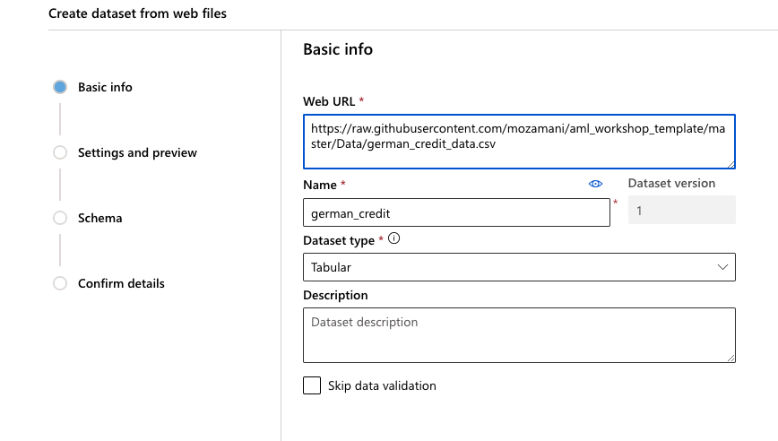

3. From 'Column headers' drop-down select 'Use headers from the first file'

   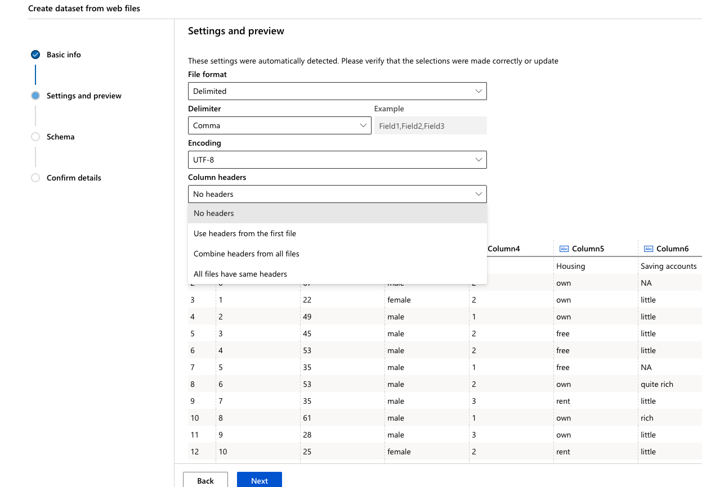

4. Click 'Next' through the following "Settings and preview" and "Schema" sections to verify that everything looks correct

    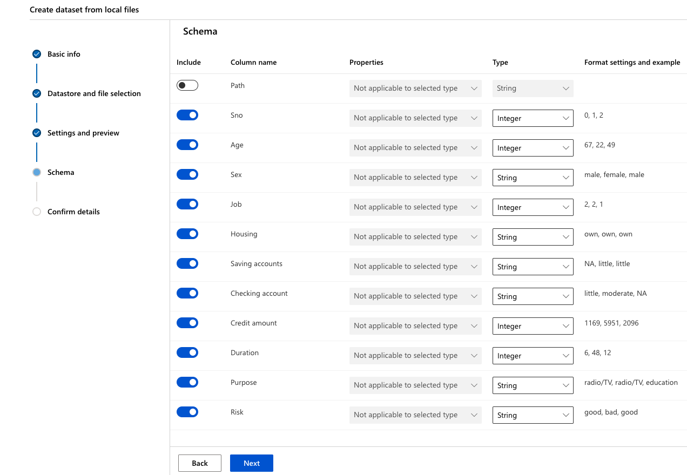

5. Finally, in the "Confirm Details" section, select "Profile this dataset after creation" and specify the 'cpu-cluster' that you previously created as the compute to use for profiling and click 'Create'

    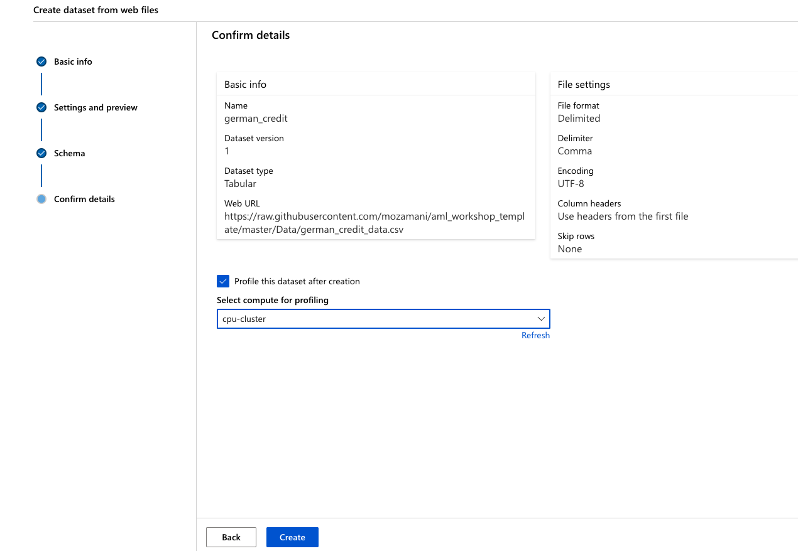

### Explore the dataset

1. Now, click on the newly created dataset and click 'Explore'. Here you can see the fields of the Tabular dataset

    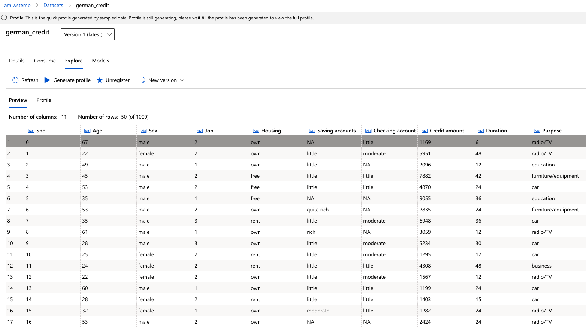

2. To view the profile of the dataset we generated in the previous step, click the "Profile" tab. If you want to regenerate a profile (or you created the dataset without selecting the profile option), you can  click "Generate profile" and select a cluster to generate profile information for the dataset

    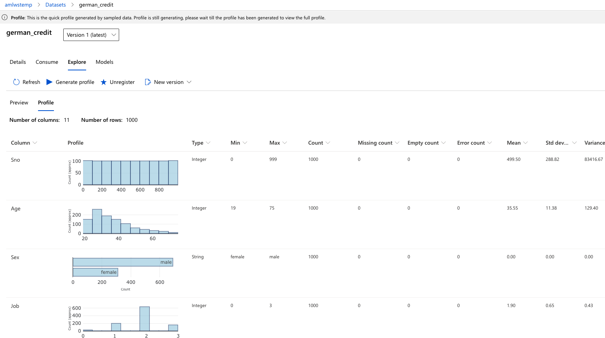

For more information on datasets, see the how-to for more information on creating and using Datasets: https://docs.microsoft.com/en-us/azure/machine-learning/service/how-to-create-register-datasets

## Review --- Option C - Create a Dataset in the SDK

