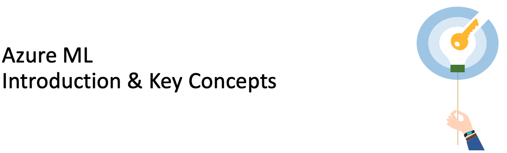

# Path 1 - AzureML: Introduction & Key Concepts

1. Introduction to Azure Machine Learning service: [L-200](../../Documents/MachineLearning_Pitch.pdf) / [L-300](../../Documents/Azure_Machine_Learning_service_L300.pdf) / [Video](https://www.youtube.com/watch?v=X7GR4ANn45s)

2. [Setup an AzureML workspace](../../0-Setup/README.md)

3. Create AzureML compute resources: [UI](../../1-Concepts/0-Compute/UI/README.md)

4. Create an AzureML Dataset: [UI](../../1-Concepts/2-Datastores-datasets/UI/README.md)

5. Introduction to Automated Machine Learning:
   - Azure Automated ML intro [L-200](../../Documents/AutomatedML.pdf) 
   - Create your first Automated ML experiment via [UI](../../2-Training/AutoML/UI/README.md)

6. Create your first  ML experiment via [Designer](../../2-Training/Designer/README.md)

7. [Set up the development environment](../../1-Concepts/1-Notebooks/README.md)

8. Create an AzureML Experiment: [Python SDK](../../1-Concepts/3-Experiments/SDK/README.md)

9. Introduction to AzureML pipelines: [Python SDK](../../1-Concepts/4-Pipelines/README.md)

10. Explore [AzureML notebook examples](https://github.com/Azure/MachineLearningNotebooks)