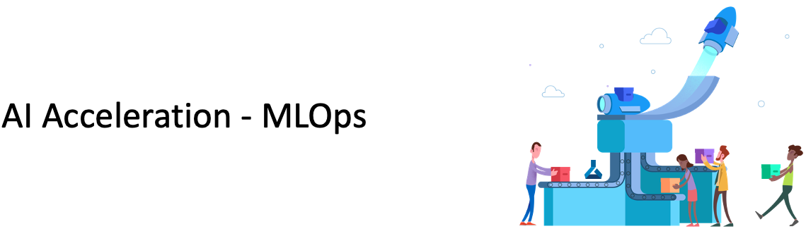

# Path 3 - AI acceleration - MLOps

1. Introduction to MLOps: [L-200](../../Documents/MLOPs_Quick_Pitch.pdf)

2. [Convert ML experimental code to production code](https://docs.microsoft.com/en-gb/azure/machine-learning/tutorial-convert-ml-experiment-to-production)

3. e2e ML process (automatic training & deployment): [DevOps classic build-release pipeline](../../4-MLOps/DevOps-Classic/README.md) / [YAML definition example 1](https://rsethur.github.io/MLOps/) / [YAML definition example 2](../../4-MLOps/DevOps-YML/0_WorkshopPrereqs.md)

4. e2e MLOps with Azure Databricks (AzureML & mlflow) [Github repo](https://github.com/SaschaDittmann/MLOps-Databricks) / [Video 1](https://www.youtube.com/watch?v=NLXis7FlnMM) / [Video 2](https://www.youtube.com/watch?v=HL36Q-eU5wU) / [Video 3](https://www.youtube.com/watch?v=fv3p3r3ByfY)

5. e2e MLOps with AzureML R SDK: [Github repo](https://github.com/ruoccofabrizio/azureml-r-mlops/tree/master/code)

6. Monitor models - enable model monitoring services with [DataDrift](https://docs.microsoft.com/en-us/azure/machine-learning/how-to-monitor-data-drift?view=azure-ml-py) and [EventGrid](https://docs.microsoft.com/en-us/azure/machine-learning/concept-event-grid-integration?view=azure-ml-py)

7. [Enterprise-readiness](../../5-Enterprise-readiness/README.md)

8. [Many model scenario](https://github.com/microsoft/solution-accelerator-many-models)
